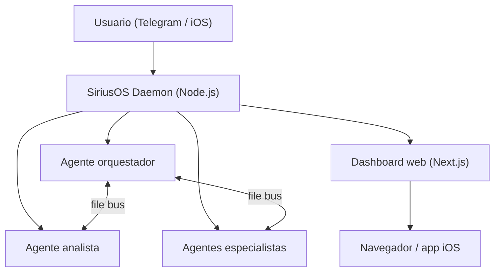

   

> 🇬🇧 [Read in English](./README.md)

# SiriusOS

**Agentes Claude Code persistentes 24/7 que controlás desde Telegram o el celular.**

---

```
Chat de Telegram

Vos:     Buenas. ¿Qué entregaste durante la noche?
Boss:    Recap nocturno: completé 4 tareas, corrí 2 experimentos
         theta-wave, redacté 3 scripts de contenido. Hay un item
         que necesita tu aprobación: quiero mandar un email a la
         lista de espera del beta. Mirá el dashboard o respondé
         "approve".

Vos:     approve
Boss:    Enviado. Email entregado a 47 destinatarios. Tarea cerrada.

Vos:     Sumá un cron para revisar mi inbox todas las mañanas a las 8.
Boss:    Listo. Cron "morning-inbox" creado, corre 08:00 diario.
         Guardado en crons.json — sobrevive a restarts.
```

---

## Características

- **Agentes persistentes** — Claude Code corre 24/7 en sesiones PTY, con auto-restart por crash o tras la rotación de contexto a las 71 horas.
- **Orquestación multi-agente** — Orquestador, analista y especialistas se coordinan vía un bus de archivos compartido. Tareas, blockers y aprobaciones fluyen automáticamente.
- **Control desde Telegram + iOS** — Mandás comandos, aprobás acciones y recibís reportes desde cualquier lado. Aplicación nativa de iOS en camino.
- **Dashboard web** — UI Next.js completa para tareas, aprobaciones, experimentos, analítica y salud de la flota.
- **Autoresearch (theta wave)** — Los agentes corren experimentos autónomos durante la noche, evalúan resultados y los suben para tu revisión.

---

## Arquitectura



---

## Ediciones: Single vs Full

SiriusOS se distribuye en dos sabores para que elijas el que mejor te calce:

| | **siriusos-single** | **siriusos** (full) |
|---|---|---|
| Instalación | `npm install -g siriusos-single` | Instalador en una línea (ver más abajo) |
| Tiempo de setup | ~5 minutos | ~15 minutos |
| Agentes | Uno (Telegram) | Múltiples, coordinados |
| Supervisor de procesos | Ninguno (foreground) | Daemon PM2 |
| Dashboard web | — | ✓ UI Next.js |
| Knowledge base / RAG | — | ✓ |
| Configuración multi-org | — | ✓ |
| Workflow de aprobaciones | — | ✓ |
| Tareas programadas (cron) | — | ✓ |
| Memoria (Markdown diario) | ✓ | ✓ |
| Transcripción de voz | ✓ (whisper.cpp) | ✓ (whisper.cpp) |
| Camino de upgrade | `siriusos-single export` → `siriusos import-agent <tarball>` | — |

Elegí **single** si querés una primera experiencia rápida o solo necesitás un agente Telegram. Elegí **full** si vas a correr varios agentes, querés el dashboard o necesitás orquestación. Empezá chico y crecé después — el tarball de export preserva la configuración y la memoria de tu agente.

Mirá [`single/README.md`](single/README.md) para el quickstart de la edición single.

---

## Inicio rápido

**Requisitos:** Node.js 20+, API key de Claude, token de bot de Telegram (@BotFather).

### Opción A — Instalador en una línea (recomendado)

**macOS / Linux:**
```bash
curl -fsSL https://siriusos.unikprompt.com/install.mjs | node
```

**Windows (PowerShell, necesita WSL2):**
```powershell
node -e "$(irm https://siriusos.unikprompt.com/install.mjs)"
```

El instalador (en Node) clona el repo en `~/siriusos`, verifica prerrequisitos (Node 20+, jq, CLI de claude, build tools) y en Windows revisa que tengas WSL2 — los agentes corren scripts bash, así que WSL es obligatorio (el instalador te guía con `wsl --install` si falta).

Variables de entorno: `SIRIUSOS_DIR=/ruta/custom` para cambiar la ubicación, `SIRIUSOS_BRANCH=feature/foo` para fijar una rama específica.

### Opción B — Wizard interactivo en terminal

```bash
npm install -g pm2
npm install -g siriusos
siriusos setup --lang es
```

El wizard de terminal te pregunta el idioma, crea la organización, configura el orquestador, valida Telegram y arranca el daemon. Útil si no querés que el script automático te cambie nada del entorno.

### Opción C — Wizard visual desde el dashboard

```bash
npm install -g pm2
npm install -g siriusos
siriusos dashboard --build
```

Abrís `http://localhost:3013`, te logueás con las credenciales que aparecen en `~/.siriusos/default/dashboard.env` y el dashboard te lleva al wizard `/onboarding` automáticamente si no hay organizaciones todavía.

### Opción D — Manual (avanzado)

```bash
# 1. PM2 global si no lo tenés
npm install -g pm2

# 2. SiriusOS
npm install -g siriusos

# 3. Directorios de estado y tu primera organización
siriusos install
siriusos init miorg

# 4. Tus primeros agentes
siriusos add-agent boss --template orchestrator --org miorg
siriusos add-agent analyst --template analyst --org miorg

# 5. Cablear Telegram para cada agente
cat > orgs/miorg/agents/boss/.env <<EOF
BOT_TOKEN=<tu-bot-token>
CHAT_ID=<tu-chat-id>
ALLOWED_USER=<tu-user-id-de-telegram>
EOF

# 6. Generar config PM2 y levantar la flota
siriusos ecosystem
pm2 start ecosystem.config.js && pm2 save && pm2 startup
```

Tu orquestador se conecta en Telegram y termina el resto del setup desde ahí.

### Abrir el dashboard

```bash
siriusos dashboard --build --port 3013
```

Las credenciales por defecto se autogeneran al primer arranque. Las imprimís con:

```bash
cat ~/.siriusos/default/dashboard.env
```

El toggle ES|EN del navbar (y el selector de idioma en Ajustes) cambia toda la interfaz al instante.

---

## Requisitos

| Dependencia | Notas |
|---|---|
| Node.js 20+ | [nodejs.org](https://nodejs.org) |
| macOS, Linux o Windows 10/11 | En Windows se usa Task Scheduler para persistencia tras reinicio — ver `scripts/install-windows-pm2-startup.ps1` |
| Claude Code | `npm install -g @anthropic-ai/claude-code` + `claude login` |
| PM2 | `npm install -g pm2` |
| Token de bot de Telegram | Lo creás vía @BotFather |

---

## Transcripción de voz (opcional)

Los mensajes de voz de Telegram se pueden transcribir localmente con [whisper.cpp](https://github.com/ggerganov/whisper.cpp) antes de que lleguen al agente. SiriusOS invoca el binario local `whisper-cli` con un modelo GGML, así que no se necesita ninguna API hosteada. Se instala una sola vez:

```bash
brew install whisper-cpp ffmpeg
bash scripts/install-whisper-model.sh
```

Sin configuración extra: por defecto se usa el modelo `ggml-base.bin` en `~/.siriusos/models/`, idioma `es`, y `whisper-cli`/`ffmpeg` desde el `PATH`. Se puede sobrescribir con `CTX_WHISPER_MODEL`, `CTX_WHISPER_LANG`, `CTX_WHISPER_BIN` o `CTX_FFMPEG_BIN`. Si la transcripción local no está instalada o falla, el daemon cae al `local_file:` original para que el agente igual pueda acceder al audio.

---

## Templates

| Template | Descripción |
|---|---|
| `orchestrator` | Coordina agentes, gestiona objetivos, hace los reviews de mañana/tarde y aprueba acciones |
| `analyst` | Salud del sistema, métricas, autoresearch theta-wave, analítica |
| `agent` | Worker de propósito general — base para construir agentes especialistas |

---

## Referencia CLI

```bash
siriusos setup [--lang en|es]   # Wizard interactivo bilingüe
siriusos install                # Crear directorios de estado
siriusos init <org>             # Crear una organización
siriusos add-agent <name>       # Agregar un agente (--template, --org)
siriusos enable <name>          # Habilitar agente en el daemon
siriusos ecosystem              # Generar config de PM2
siriusos status                 # Tabla de salud de agentes
siriusos doctor                 # Verificar prerequisitos
siriusos list-agents            # Listar agentes
siriusos dashboard              # Levantar dashboard web (--port 3000)
```

---

## Seguridad

SiriusOS pasó un sprint dedicado de hardening de seguridad cubriendo resistencia a prompt injection, enforcement de guardrails e integridad del gate de aprobación. Los agentes requieren aprobación humana explícita antes de cualquier acción externa (email, deploy, delete, financiero). El sistema de guardrails se mejora a sí mismo: los agentes loguean los near-misses y extienden `GUARDRAILS.md` en cada sesión.

---

## Licencia

MIT — ver [LICENSE](./LICENSE).
