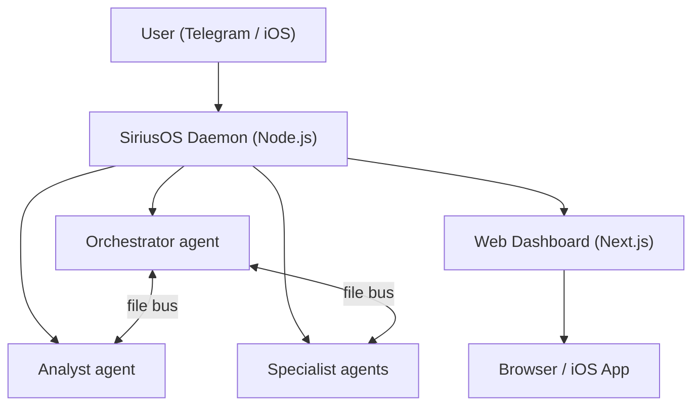

   

> 🇪🇸 [Leer en español](./README.es.md)

# SiriusOS

**Persistent 24/7 Claude Code agents you control from Telegram or your phone.**

---

```
Telegram chat

You:     Morning. What did you ship overnight?
Boss:    Overnight recap: completed 4 tasks, ran 2 theta-wave
         experiments, drafted 3 content scripts. One item needs
         your approval — I want to email the beta waitlist.
         Check the dashboard or reply "approve".

You:     approve
Boss:    Sent. Email delivered to 47 recipients. Task closed.

You:     Add a cron to check my inbox every morning at 8am.
Boss:    Done. "morning-inbox" cron set — runs daily at 08:00.
         Saved to crons.json — survives restarts automatically.
```

---

## Features

- **Persistent agents** — Claude Code runs 24/7 in PTY sessions, auto-restarting on crash or after 71-hour context rotation.
- **Multi-agent orchestration** — Orchestrator, Analyst, and specialist agents coordinate via a shared file bus. Tasks, blockers, and approvals flow automatically.
- **Telegram + iOS control** — Send commands, approve actions, and get reports from anywhere. Native iOS app coming soon.
- **Web dashboard** — Full-featured Next.js UI for tasks, approvals, experiments, analytics, and agent fleet health.
- **Autoresearch (theta wave)** — Agents run autonomous experiments overnight, evaluate results, and surface findings for your review.

---

## Architecture



---

## Editions: Single vs Full

SiriusOS ships in two flavors so you can pick the right footprint:

| | **siriusos-single** | **siriusos** (full) |
|---|---|---|
| Install | `npm install -g siriusos-single` | One-line installer (see below) |
| Setup time | ~5 minutes | ~15 minutes |
| Agents | One Telegram agent | Multiple, coordinated |
| Process supervisor | None (foreground) | PM2 daemon |
| Web dashboard | — | ✓ Next.js UI |
| Knowledge base / RAG | — | ✓ |
| Multi-org configuration | — | ✓ |
| Approvals workflow | — | ✓ |
| Cron-scheduled tasks | — | ✓ |
| Memory (daily Markdown) | ✓ | ✓ |
| Voice transcription | ✓ (whisper.cpp) | ✓ (whisper.cpp) |
| Upgrade path | `siriusos-single export` → `siriusos import-agent <tarball>` | — |

Pick **single** if you want a quick first-time experience or just need a single Telegram agent. Pick **full** if you're running multiple agents, want the dashboard, or need orchestration. Start small and upgrade later — the export tarball preserves your agent's config and memory.

See [`single/README.md`](single/README.md) for the single-edition quickstart.

---

## Quick Start

**Requirements:** Node.js 20+, Claude API key, Telegram bot token from @BotFather.

### Option A — One-line installer (recommended)

**macOS / Linux:**
```bash
curl -fsSL https://siriusos.unikprompt.com/install.mjs | node
```

**Windows (PowerShell, requires WSL2):**
```powershell
node -e "$(irm https://siriusos.unikprompt.com/install.mjs)"
```

The Node-based installer clones the repo into `~/siriusos`, verifies prerequisites (Node 20+, jq, claude CLI, build tools), and on Windows checks for WSL2 — agents run shell scripts under bash, so WSL is required (the installer points you to `wsl --install` if missing).

Override the install location with `SIRIUSOS_DIR=/custom/path` or pin a branch with `SIRIUSOS_BRANCH=feature/foo`.

### Option B — Visual wizard from the dashboard

```bash
npm install -g pm2
npm install -g siriusos
siriusos dashboard --build
```

Open `http://localhost:3013`, sign in with the credentials from `~/.siriusos/default/dashboard.env`, and you are routed automatically to `/onboarding` if no organization exists yet.

### Option C — Manual (advanced)

```bash
npm install -g pm2
npm install -g siriusos

siriusos install
siriusos init myorg
siriusos add-agent boss --template orchestrator --org myorg
siriusos add-agent analyst --template analyst --org myorg

cat > orgs/myorg/agents/boss/.env <<EOF
BOT_TOKEN=<your-bot-token>
CHAT_ID=<your-chat-id>
ALLOWED_USER=<your-telegram-user-id>
EOF

siriusos ecosystem
pm2 start ecosystem.config.js && pm2 save && pm2 startup

# Windows: pm2 startup is unsupported. Use Task Scheduler instead:
#   powershell -ExecutionPolicy Bypass -File scripts\install-windows-pm2-startup.ps1
```

The orchestrator comes online in Telegram and you finish setup from there.

### Open the dashboard later

```bash
siriusos dashboard --build --port 3013
cat ~/.siriusos/default/dashboard.env  # credentials
```

The ES|EN toggle lives in the navbar and in Settings → Appearance → Language.

---

## Requirements

| Dependency | Notes |
|---|---|
| Node.js 20+ | [nodejs.org](https://nodejs.org) |
| macOS, Linux, or Windows 10/11 | Windows uses Task Scheduler for reboot persistence — see `scripts/install-windows-pm2-startup.ps1` |
| Claude Code | `npm install -g @anthropic-ai/claude-code` + `claude login` |
| PM2 | `npm install -g pm2` |
| Telegram bot token | Create via @BotFather |

---

## Voice Transcription (optional)

Telegram voice messages can be auto-transcribed locally with [whisper.cpp](https://github.com/ggerganov/whisper.cpp) before they reach the agent. SiriusOS invokes the local `whisper-cli` binary with a GGML model, so no hosted API is required. Install once to enable:

```bash
brew install whisper-cpp ffmpeg
bash scripts/install-whisper-model.sh
```

Zero config: defaults are model `ggml-base.bin` at `~/.siriusos/models/`, language `es`, and `whisper-cli`/`ffmpeg` from `PATH`. Override with `CTX_WHISPER_MODEL`, `CTX_WHISPER_LANG`, `CTX_WHISPER_BIN`, or `CTX_FFMPEG_BIN`. If local transcription is missing or fails, the daemon falls back to the existing `local_file:` injection so the agent can still reach the audio.

---

## Templates

| Template | Description |
|---|---|
| `orchestrator` | Coordinates agents, manages goals, handles morning/evening reviews, approves actions |
| `analyst` | System health, metrics, theta-wave autoresearch, analytics |
| `agent` | General-purpose worker — use this as the base for specialist agents |

---

## CLI Reference

```bash
siriusos install            # Set up state directories
siriusos init <org>         # Create an organization
siriusos add-agent <name>   # Add an agent (--template, --org)
siriusos enable <name>      # Enable agent in daemon
siriusos ecosystem          # Generate PM2 config
siriusos status             # Agent health table
siriusos doctor             # Check prerequisites
siriusos list-agents        # List agents
siriusos dashboard          # Start web dashboard (--port 3000)
```

---

## Security

SiriusOS has undergone a dedicated security hardening sprint covering prompt injection resistance, guardrail enforcement, and approval gate integrity. Agents require explicit human approval before any external action (email, deploy, delete, financial). The guardrails system is self-improving: agents log near-misses and extend GUARDRAILS.md each session.

---

## License

MIT — see [LICENSE](./LICENSE).
